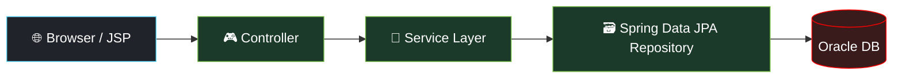
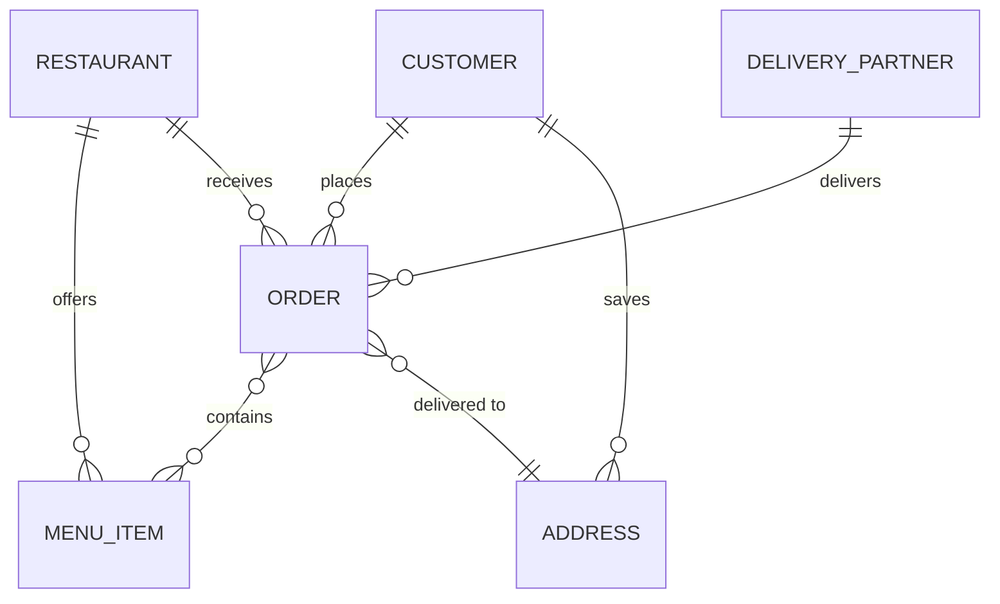
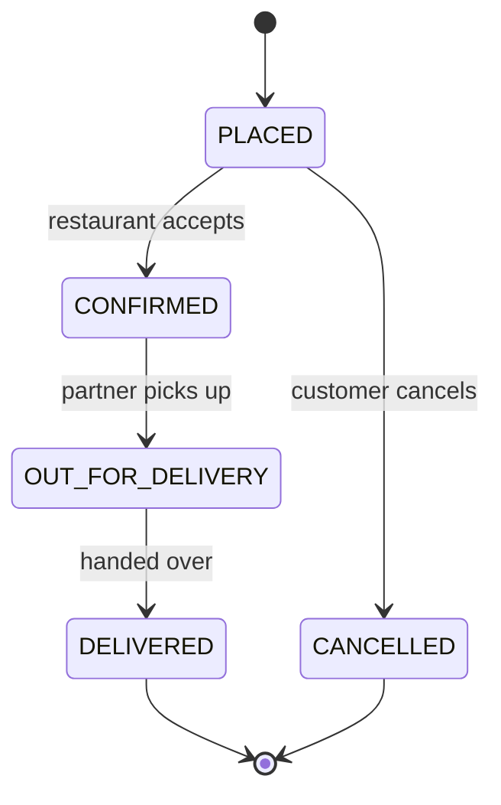

<div align="center">


<a href="https://git.io/typing-svg">
  
</a>

<br/><br/>


<br/>


</div>

---

## 🌱 `Application.java` — my profile, written as a Spring Boot app

```java
@SpringBootApplication
public class AdarshApplication {

    public static void main(String[] args) {
        SpringApplication.run(AdarshApplication.class, args);
    }
}

@RestController
@RequestMapping("/api/adarsh")
class ProfileController {

    @GetMapping
    public Developer whoAmI() {
        return Developer.builder()
            .name("Adarsh Gadekar")
            .role("Java Full-Stack Developer")
            .degree("B.Tech, Computer Science & Engineering (2026)")
            .backend(List.of("Core Java", "JDBC", "Servlets", "JSP", "Spring Boot", "Spring Data JPA", "Hibernate"))
            .frontend(List.of("React", "JavaScript", "HTML5", "CSS3", "Bootstrap"))
            .database(List.of("Oracle SQL", "PL/SQL", "MySQL"))
            .learning(List.of("REST API design", "Microservices", "System Design"))
            .openToWork(true)
            .build();
    }

    @GetMapping("/hire")
    public ResponseEntity<String> hire() {
        return ResponseEntity.ok("200 OK — let's build something great together 🚀");
    }
}
```

<details>
<summary><b>⚙️ application.yml</b> — my runtime configuration</summary>

```yaml
adarsh:
  profile: production
  mindset: "turn ideas into working applications"
  focus:
    - Java Full-Stack
    - Backend Development
    - REST APIs
  collaborate-on: [ "Java Full Stack", "Backend", "Web Development" ]
  seeking-help-with: [ "Spring Boot", "React", "REST APIs", "System Design" ]
  ask-me-about:
    [ Java, OOPs, Collections, SQL, JDBC, Servlets, JSP, Spring Boot, JPA/Hibernate, Web Development ]
  contact:
    email: adarshgadekar58@gmail.com
```

</details>

---

## 📈 Benchmarks (from my real projects)

| Metric | Result | Where |
|:--|:--:|:--|
| ⚡ SQL retrieval time cut with joins + indexing | **30%** | Student Management Portal |
| ⚡ Query performance gain | **25%** | Employee Lifecycle System |
| 🗂️ Employee records handled with secure CRUD | **250+** | Employee Lifecycle System |
| 🧩 Reusable DAO modules | **6** | Student Management Portal |
| 🔗 JPA/Hibernate entity relationships modeled | **7** | Food Ordering Platform |
| 🛡️ Endpoints protected with parameterized queries | **5** | Employee Lifecycle System |

---

## 🚀 Projects

### 🍔 Food Ordering & Delivery Management System
`Java` `Spring Boot` `Spring Data JPA` `Hibernate` `JSP` `Bootstrap` `MVC`

A full-stack platform covering restaurant browsing, menu selection, order placement, address management and delivery tracking.

**Layered architecture**



**Entity relationships (JPA / Hibernate)**



**Order lifecycle with validated transitions**



---

### 🎓 Student Management Portal
`Java` `Servlets` `JSP` `JDBC` `Oracle SQL`

A 3-tier MVC web app with full CRUD for 20+ student records across 4 modules, HTTP session handling, form validation, JDBC `PreparedStatement`s and a reusable DAO layer.

### 🧑‍💼 Employee Lifecycle Management System
`Java` `JDBC` `Oracle SQL`

A backend application managing 250+ employee records on a normalized 4-table schema, with parameterized queries to prevent SQL injection.

---

## 🧭 Learning Roadmap



<sub>🟩 done &nbsp; 🟨 in progress &nbsp; 🟪 up next</sub>

---

## 🛠️ Tech Stack

<div align="center">

| Layer | Technologies |
|:--|:--|
| **Languages** |     |
| **Backend** |       |
| **Frontend** |     |
| **Database** |   |
| **Tools & Cloud** |        |

</div>

---

## 🎓 Education & Training

```mermaid
flowchart LR
    A[Core Java<br/>OOP • Collections]:::done --> B[JDBC<br/>Oracle SQL]:::done
    B --> C[Servlets<br/>JSP • MVC]:::done
    C --> D[Spring Boot<br/>Spring Data JPA]:::done
    D --> E[Hibernate<br/>Advanced Mapping]:::doing
    E --> F[React<br/>Full-Stack Apps]:::doing
    F --> G[REST API<br/>Design]:::doing
    G --> H[Microservices<br/>System Design]:::next

    classDef done  fill:#1b3a2a,stroke:#6db33f,color:#fff;
    classDef doing fill:#3a3a1b,stroke:#f0c000,color:#fff;
    classDef next  fill:#2a1b3a,stroke:#a06bff,color:#fff;
```

| | |
|:--|:--|
| 🧑‍🏫 **Java Full-Stack Development Training** | NareshIT Technologies — May 2026 |
| 🎓 **B.Tech, Computer Science & Engineering** | Bharat Ratna Indira Gandhi College of Engineering, Solapur (2022–2026) |

---

## 🔥 Contribution Streak

<div align="center">


</div>

---

## 📬 Let's Connect

<div align="center">

<a href="https://www.linkedin.com/in/adarsh-gadekar-b37564302"></a>
<a href="mailto:adarshgadekar58@gmail.com"></a>
<a href="https://instagram.com/adarsh_gadekar_07"></a>
<a href="https://github.com/adarshgadekar58"></a>

<br/><br/>

```text
2026-09-19 INFO  --- [main] c.a.AdarshApplication : Ready to collaborate. Send a request. 🚀
```


</div>
