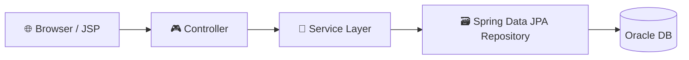
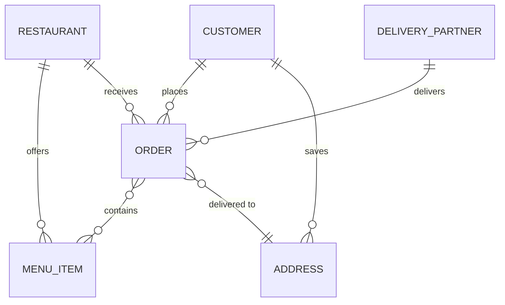
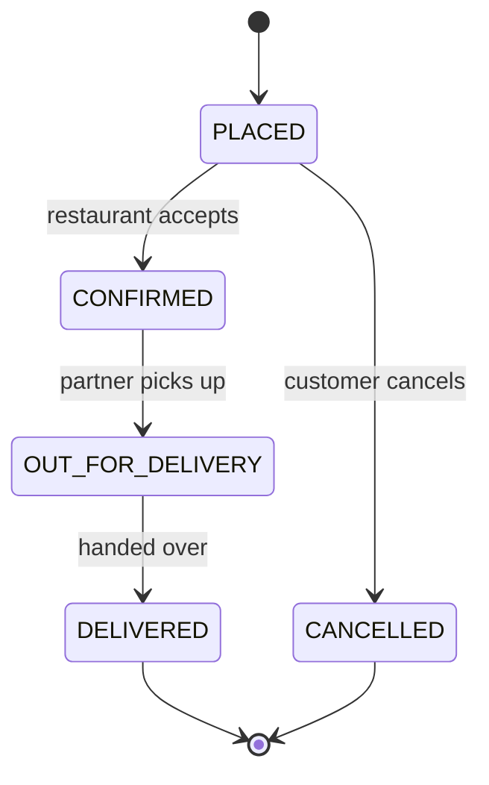

<div align="center">


<a href="https://git.io/typing-svg">
  
</a>

<br/><br/>


&nbsp;&nbsp;

&nbsp;&nbsp;

&nbsp;&nbsp;

&nbsp;&nbsp;


<br/><br/>

<a href="https://www.linkedin.com/in/adarsh-gadekar-b37564302"></a>
<a href="mailto:adarshgadekar58@gmail.com"></a>
<a href="https://instagram.com/adarsh_gadekar_07"></a>
<a href="https://github.com/adarshgadekar58"></a>

<br/>


</div>

<br/>

<h2> About Me</h2>

```java
public class Adarsh implements FullStackDeveloper {

    String role      = "Java Full-Stack Developer";
    String building  = "Spring Boot + React + Oracle SQL applications";
    String learning  = "REST API design, Microservices, System Design";
    String mindset   = "Turn ideas into working applications 🚀";

    boolean openToCollaborate = true;  // Java Full Stack • Backend • Web Development
}
```

<div align="center">
<table>
<tr>
<td align="center" width="25%">
<br/>
<b>Working on</b><br/>
<sub>Full-stack apps with Java, Spring Boot, React, Oracle SQL, JPA/Hibernate</sub>
</td>
<td align="center" width="25%">
<br/>
<b>Learning</b><br/>
<sub>Spring Data JPA, Hibernate, REST APIs, React, Microservices</sub>
</td>
<td align="center" width="25%">
<br/>
<b>Need help with</b><br/>
<sub>Spring Boot, React, REST APIs, System Design</sub>
</td>
<td align="center" width="25%">
<br/>
<b>Ask me about</b><br/>
<sub>Java, OOPs, Collections, SQL, JDBC, Servlets, JSP, Spring Boot, JPA/Hibernate</sub>
</td>
</tr>
</table>
</div>

<br/>

<h2> Tech Stack</h2>

<div align="center">


</div>

<br/>

<h2> Impact in Numbers</h2>

<div align="center">
<table>
<tr>
<td align="center" width="25%">
<br/>
<h1>30%</h1>
<b>Faster SQL retrieval</b><br/>
<sub>Joins + indexing on Oracle</sub>
</td>
<td align="center" width="25%">
<br/>
<h1>250+</h1>
<b>Employee records</b><br/>
<sub>Secure JDBC CRUD operations</sub>
</td>
<td align="center" width="25%">
<br/>
<h1>7</h1>
<b>JPA relationships</b><br/>
<sub>@OneToMany • @ManyToOne</sub>
</td>
<td align="center" width="25%">
<br/>
<h1>6</h1>
<b>Reusable DAO modules</b><br/>
<sub>Clean, maintainable layers</sub>
</td>
</tr>
</table>
</div>

<br/>

<h2> Projects</h2>

<table>
<tr>
<td width="100%">

### 🍔 Food Ordering & Delivery Management System &nbsp;`FEATURED`
Full-stack platform covering restaurant browsing, menu selection, order placement, address management and delivery tracking.

     

**5 core modules • 7 JPA entity relationships • 4 validated order-status transitions**

</td>
</tr>
</table>

<table>
<tr>
<td width="50%" valign="top">

### 🎓 Student Management Portal
3-tier MVC portal with full CRUD for 20+ student records across 4 modules, HTTP sessions, form validation and a reusable DAO layer.

   

**SQL retrieval time cut by 30%**

</td>
<td width="50%" valign="top">

### 🧑‍💼 Employee Lifecycle System
Secure JDBC CRUD for 250+ employees on a normalized 4-table schema, with parameterized queries across 5 endpoints.

  

**Query performance improved by 25%**

</td>
</tr>
</table>

<details>
<summary><b>🏗️ Food Ordering System — architecture, ER diagram & order lifecycle</b></summary>

<br/>







</details>

<br/>

<h2> Learning Roadmap</h2>



<div align="center"><sub>🟩 done &nbsp; 🟨 in progress &nbsp; 🟪 up next</sub></div>

<br/>

<h2> Education & Training</h2>

```mermaid
flowchart LR
    A[Core Java<br/>OOP • Collections]:::done --> B[JDBC<br/>Oracle SQL]:::done
    B --> C[Servlets<br/>JSP • MVC]:::done
    C --> D[Spring Boot<br/>Spring Data JPA]:::done
    D --> E[Hibernate<br/>Advanced Mapping]:::doing
    E --> F[React<br/>Full-Stack Apps]:::doing
    F --> G[REST API<br/>Design]:::doing
    G --> H[Microservices<br/>System Design]:::next

    classDef done  fill:#1b3a2a,stroke:#6db33f,color:#fff;
    classDef doing fill:#3a3a1b,stroke:#f0c000,color:#fff;
    classDef next  fill:#2a1b3a,stroke:#a06bff,color:#fff;
```

| | |
|:--|:--|
| 🧑‍🏫 **Java Full-Stack Development Training** | NareshIT Technologies — May 2026 |
| 🎓 **B.Tech, Computer Science & Engineering** | Bharat Ratna Indira Gandhi College of Engineering, Solapur (2022–2026) |

<br/>

<div align="center">


### Let's build something great together

<a href="mailto:adarshgadekar58@gmail.com"></a>


</div>
