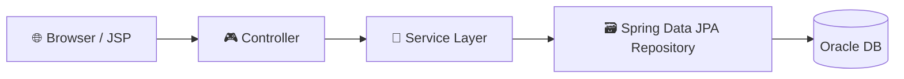
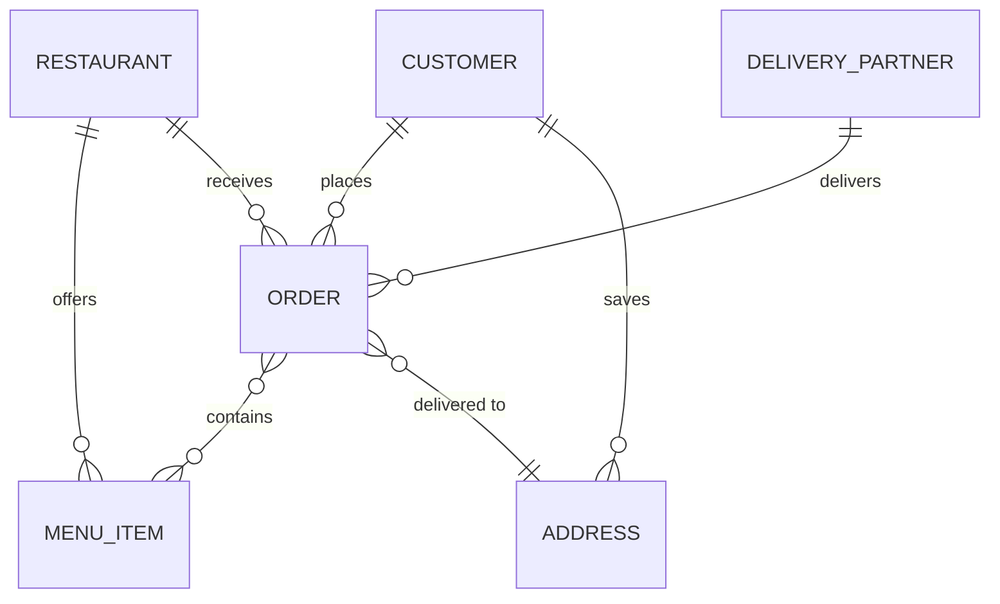
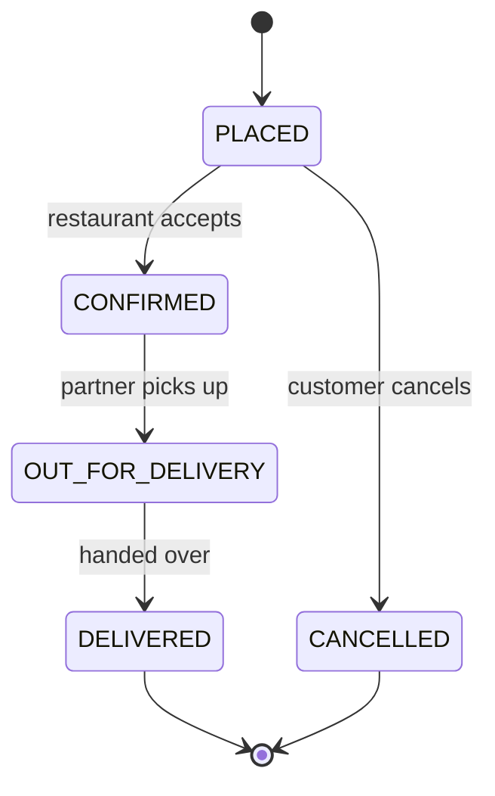

<div align="center">


<a href="https://git.io/typing-svg">
  
</a>

<br/>

&nbsp;&nbsp;
&nbsp;&nbsp;
&nbsp;&nbsp;
&nbsp;&nbsp;


<br/><br/>

<a href="https://www.linkedin.com/in/adarsh-gadekar-b37564302"></a>
<a href="mailto:adarshgadekar58@gmail.com"></a>
<a href="https://instagram.com/adarsh_gadekar_07"></a>
<a href="https://github.com/adarshgadekar58"></a>

<br/>


</div>

<br/>

## ⚡ 30-Second Recruiter Scan

| | |
|:--|:--|
| 🎯 **Target roles** | Java Developer • Java Full-Stack Developer • Backend Developer (Spring Boot) |
| 🎓 **Education** | B.Tech, Computer Science & Engineering — graduating **2026** |
| 🏫 **Training** | Java Full-Stack Development, NareshIT Technologies (May 2026), project-based |
| 🧱 **Core stack** | Java • Spring Boot • Spring Data JPA • Hibernate • JDBC • Oracle SQL • React |
| 📦 **Built** | 3 projects: Student Portal, Employee System, Food Ordering Platform (details below) |
| 📈 **Results** | SQL queries **30% faster** • **250+** records handled • **7** JPA entity relationships modeled |
| 🟢 **Status** | Open to work and collaboration |
| 📬 **Reach me** | [adarshgadekar58@gmail.com](mailto:adarshgadekar58@gmail.com) • [LinkedIn](https://www.linkedin.com/in/adarsh-gadekar-b37564302) |

<br/>

<h2> About Me</h2>

```java
public class Adarsh implements FullStackDeveloper {

    String role      = "Java Full-Stack Developer";
    String building  = "Spring Boot + React + Oracle SQL applications";
    String learning  = "Spring MVC Architecture, Spring Security, REST API";
    String mindset   = "Turn ideas into working applications 🚀";

    boolean openToCollaborate = true;  // Java Full Stack • Backend • Web Development
}
```

<div align="center">
<table>
<tr>
<td align="center" width="25%">
<br/>
<b>Working on</b><br/>
<sub>Full-stack apps with Java, Spring Boot, React, Oracle SQL, JPA/Hibernate</sub>
</td>
<td align="center" width="25%">
<br/>
<b>Learning</b><br/>
<sub>Spring MVC Architecture, Spring Security, REST API, Spring Data JPA, Hibernate, React, Microservices</sub>
</td>
<td align="center" width="25%">
<br/>
<b>Need help with</b><br/>
<sub>Spring Boot, React, REST APIs, System Design</sub>
</td>
<td align="center" width="25%">
<br/>
<b>Ask me about</b><br/>
<sub>Java, OOPs, Collections, SQL, JDBC, Servlets, JSP, Spring Boot, JPA/Hibernate</sub>
</td>
</tr>
</table>
</div>

<br/>

<h2> My Journey: From School to Full-Stack Developer</h2>

<!--
  EDIT ME: add 1-2 personal lines below (what first got you into coding? why Java? a moment you're proud of).
  Personal stories are what recruiters remember. Keep it true and short.
-->

> I grew up in **Akkalkot, Solapur**, finished school there, and stepped into engineering in **2022** with one goal: to learn how software really gets built, not just how it looks. I started with programming fundamentals, chose **Java** as my main language, and kept building on it year after year: OOP, Collections, SQL, then JDBC, Servlets and JSP, and finally Spring Boot, JPA and Hibernate. In **2026** I joined a project-based Java Full-Stack program at NareshIT, where I turned that foundation into three working applications.

| When | Milestone | What it gave me |
|:--:|:--|:--|
| **2019** | 10th Standard, Shree Shardamata English Medium High School, Akkalkot (**73.40%**) | Strong school foundation |
| **2021** | 12th Standard, C. B. Khedgi's College, Akkalkot (**72.17%**) | Science and problem-solving base for engineering |
| **2022** | Joined **B.Tech in Computer Science & Engineering**, Bharat Ratna Indira Gandhi College of Engineering, Solapur | Programming fundamentals, OOP, data structures and DBMS |
| **2022–25** | Went deeper into **Core Java, Collections, SQL** and web basics | Solid language skills and database thinking |
| **May 2026** | Completed **Java Full-Stack Training** at NareshIT Technologies | Built Servlets/JSP, Spring Boot, JPA and Hibernate projects hands-on |
| **2026** | Graduating B.Tech CSE and building **3 full applications** | Real proof of work: measurable performance gains, clean architecture |
| **Now** | Learning **Spring MVC Architecture, Spring Security, REST API**, React and Microservices | Growing from working apps to production-grade, secure systems |

<br/>

<h2> Tech Stack: with Proof</h2>

<sub>Every skill below is tied to a project where I used it. If it's not backed by something I built, it's listed as *learning*.</sub>

### ✅ Project-proven

| Skill | Where I used it | Evidence |
|:--|:--|:--|
|  **Core Java, OOP, Collections** | All 3 projects | Business logic across 5 domain entities: customers, restaurants, menu items, orders, delivery partners |
|  **JDBC** | Student Portal, Employee System | `PreparedStatement` + parameterized queries on **5 endpoints** to prevent SQL injection |
|  **Servlets, JSP, MVC** | Student Portal | 3-tier MVC app, HTTP session handling, form validation across **4 modules** |
|  **Oracle SQL** | Student Portal, Employee System | Normalized **4-table** schema; joins and indexing cut query time by **30%** and **25%** |
|  **Spring Boot** | Food Ordering Platform | Full-stack app with **5 core modules**, from restaurant browsing to delivery tracking |
|   **Spring Data JPA + Hibernate** | Food Ordering Platform | **7 entity relationships** using `@Entity`, `@Id`, `@OneToMany`, `@ManyToOne`, `@JoinColumn` |
|   **HTML, CSS, JavaScript, Bootstrap** | Food Ordering, Student Portal | Responsive UI layered on JSP/MVC backends |
|   **Git, GitHub, Maven** | All projects | Version-controlled, build-managed codebases |

### 🌱 Learning right now

    

### 📚 Also familiar with

     

### 💼 What I bring to a team

- **Secure by default:** parameterized queries and validated inputs instead of string-built SQL.
- **Data-minded:** normalized schemas, sensible indexes and measurable query speedups.
- **Clean structure:** layered MVC and DAO design that makes features easy to add.
- **Ships end to end:** database, backend logic and UI in a single application.
- **Fast, honest learner:** I show what I know, and I'm actively closing the gaps.

<br/>

<h2> Impact in Numbers</h2>

<div align="center">
<table>
<tr>
<td align="center" width="25%">
<br/>
<h2>30%</h2>
<b>Faster SQL retrieval</b><br/>
<sub>Joins + indexing on Oracle</sub>
</td>
<td align="center" width="25%">
<br/>
<h2>250+</h2>
<b>Employee records</b><br/>
<sub>Secure JDBC CRUD operations</sub>
</td>
<td align="center" width="25%">
<br/>
<h2>7</h2>
<b>JPA relationships</b><br/>
<sub>@OneToMany • @ManyToOne</sub>
</td>
<td align="center" width="25%">
<br/>
<h2>6</h2>
<b>Reusable DAO modules</b><br/>
<sub>Clean, maintainable layers</sub>
</td>
</tr>
</table>
</div>

<br/>

<h2> Projects</h2>

<table>
<tr>
<td width="100%">

### 🍔 Food Ordering & Delivery Management System &nbsp;`FEATURED`
Full-stack platform covering restaurant browsing, menu selection, order placement, address management and delivery tracking.

     

**5 core modules • 7 JPA entity relationships • 4 validated order-status transitions**

</td>
</tr>
</table>

<table>
<tr>
<td width="50%" valign="top">

### 🎓 Student Management Portal
3-tier MVC portal with full CRUD for 20+ student records across 4 modules, HTTP sessions, form validation and a reusable DAO layer.

   

**SQL retrieval time cut by 30%**

</td>
<td width="50%" valign="top">

### 🧑‍💼 Employee Lifecycle System
Secure JDBC CRUD for 250+ employees on a normalized 4-table schema, with parameterized queries across 5 endpoints.

  

**Query performance improved by 25%**

</td>
</tr>
</table>

<details>
<summary><b>🏗️ Food Ordering System: architecture, ER diagram & order lifecycle</b></summary>

<br/>







</details>

<br/>

<h2> Learning Roadmap</h2>



<div align="center"><sub>🟩 done &nbsp; 🟨 in progress &nbsp; 🟪 up next</sub></div>

<br/>

<div align="center">


```mermaid
flowchart LR
    A[Core Java<br/>OOP • Collections]:::done --> B[JDBC<br/>Oracle SQL]:::done
    B --> C[Servlets<br/>JSP • MVC]:::done
    C --> D[Spring Boot<br/>JPA • Hibernate]:::done
    D --> E[Spring MVC<br/>Architecture]:::doing
    E --> F[REST API<br/>Design]:::doing
    F --> G[Spring Security<br/>Auth • Authorization]:::doing
    G --> H[React<br/>Full-Stack Apps]:::doing
    H --> I[Microservices<br/>System Design]:::next

    classDef done  fill:#1b3a2a,stroke:#6db33f,color:#fff;
    classDef doing fill:#3a3a1b,stroke:#f0c000,color:#fff;
    classDef next  fill:#2a1b3a,stroke:#a06bff,color:#fff;
```

### Let's build something great together

<a href="mailto:adarshgadekar58@gmail.com"></a>


</div>
